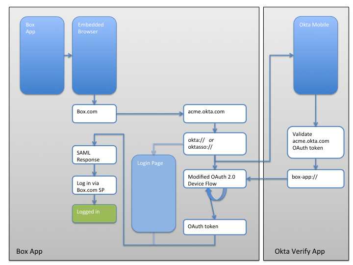

# Okta Mobile Connect: Technical Overview

## Introduction

This document provides a high-level overview of how to add Single Sign
On capabilities to your native iOS application.

Two scenarios are covered in this document:

1.  Your native iOS application already supports logging in using the Security Assertion Markup Language (SAML).
2.  Your native iOS application does not support SAML.

## If your application already supports SAML

In the scenario where your application already supports logging in via
SAML, your application may already work with Okta Mobile Connect.

Applications that already support SAML and have the following two
characteristics will work with Okta Mobile Connect:

-   The embedded web browser used for SAML authentication requests
    allows requests to be made to Okta’s URL schemes: `oktasso://` and `okta://`
-   The application has a registered URL scheme and supports being
    called by this URL scheme.

Beginning with iOS 9, applications must whitelist URLs they plan to open. Add the following to your Info.plist to allow opening Okta Mobile, if you already have an `LSApplicationQueriesScheme` entry append `okta` and `oktasso` to it.

~~~~
	<key>LSApplicationQueriesSchemes</key>
 	<array>
 		<string>okta</string>
 		<string>oktasso</string>
 	</array>
~~~~

Typically, mobile applications that support SAML use an embedded browser
to do the SAML request flow. A best practice for mobile SAML support is
to restrict the embedded browser to a URL “whitelist”. In cases like
this, the embedded browser that does the SAML request flow must allow
the following URL schemes to be opened:

-   `oktasso://`
-   `okta://`

The URL schemes above are used to open Okta’s native mobile application
and start the Mobile SSO flow.

To return to your application from the Okta Mobile Connect flow, your
application must support being opened via a similar URL scheme.
Additionally, when your application is called by the URL scheme, it must
return to where the user last left off in the SAML flow – the equivalent
to the user “foregrounding” or switching back to the application.

To get a better understanding of how your application will communicate
with Okta’s mobile application for the Okta Mobile Connect flow,
refer to the section named “Overview of how it works” below.

## If your application does not support SAML

If your application does not currently support logging in via SAML, you
will need to add SAML support to your application in order to take
advantage of Okta Mobile Connect.

The specifics of how to add SAML support to your application are out of
the scope of this document. That said, here is what your application
will need to do, at a high level:

1.  Add a “Single Sign On” option to your login flow.
2.  People who tap on the “Single Sign On” option will be prompted to
    enter their email address.
3.  Using the users email address, your application will open an
    embedded web browser and send a SAML authentication request to the
    Identity Provider that handles authentication requests for that
    user. (In technical terms, you’ll need to use the embedded browser
    to send an AuthN request to the IdP via HTTP)
4.  The embedded browser will follow a series of SAML redirects and
    eventually end up on one of your back-end servers. Once it reaches
    your servers, you’ll need to copy the authentication credentials
    from the embedded browser into your mobile application.
5.  Your native mobile application is now authenticated to your back end servers.

See the "SAML-Sample" directory in this project for an example of how
to implement SAML based login for an iOS application.

## How Okta Mobile Connect works – an overview

The process via which Okta enables Single Sign On in native mobile
applications is best understood via the following block diagram.
Additional details are included following the block diagram.

**Figure 1: Okta Mobile Connect user flow**

In the Figure 1 above, we use the example of the “Box” mobile application from
Box.com, the application flow works as follows:

1.  The user opens the “Box” application
2.  The user clicks on the “Single Sign On” option and is taken to
    the “Embedded Browser”
3.  The “Embedded Browser” opens box.com, which prompts the user to
    enter in their email address. Using that email address box.com
    determines that the user’s authentication server is located at
    “acme.okta.com” (Where “acme” is the name of the Okta organization
    that the user is part of), the embedded browser is then redirected
    to “acme.okta.com”
4.  The server at “acme.okta.com” determines that the user is coming
    from a mobile application and instructs the embedded browser to open
    a link to “oktasso://”
	-   If the Okta Mobile Application is installed, the “Okta Mobile”
    application will be sent a one-time token and open on the users
    device.
	-   If the Okta Mobile Application is not installed, the user will see
		the “Login Page” which will ask them to enter in their password.
5.  Assuming that the Okta Mobile application is installed, the user
    will be prompted by the Okta Mobile application to enter their PIN.
    Upon successful entry of their PIN, the Okta Mobile application will
    validate the one-time token it received from “acme.okta.com” and
    will then redirect the user back into the app that they came from
    “box-app://” in this case.
6.  Meanwhile, the Box application will be continually polling to see if
    the token it sent to the Okta Mobile application has been
    validated.
7.  When the Okta Mobile application redirects the user back to the Box
    application, the token should be valid.
8.  With a valid token the embedded browser will use the validated token
    to initiate a SAML Response.
9.   If the Okta Mobile application is not installed, the user will have
    entered their password into the login form and will be sent a SAML
    Response.
10. Once it has a SAML Response, the embedded browser will be able to
    log the user in to the Box servers. 

This example assumes the best-case scenario and does not describe how
failures should be handled.
